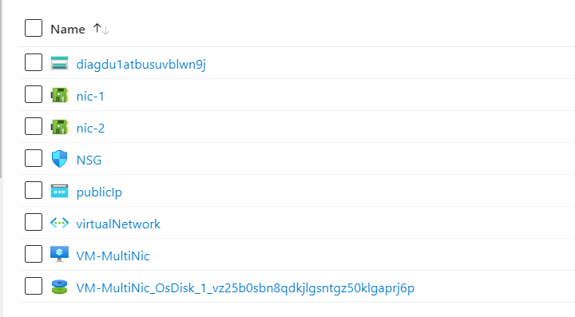

Cloud Shelll has in-built terraform libraries, deploy these configurations on Cloud Shell

[](https://shell.azure.com)

# Terraform: 101-1vm-2nics-2subnets-1vnet 
## Multi-NIC Virtual Machine Creation using Two Subnets

## Description

This is a conversion of ARM template *[101-1vm-2nics-2subnets-1vnet](https://github.com/Azure/azure-quickstart-templates/tree/master/101-1vm-2nics-2subnets-1vnet)* from the repository *[azure\azure-quickstart-templates](https://github.com/Azure/azure-quickstart-templates)* to Terraform code, and this code will deploy following the resources…




> ### Note:
> If there is already the specified resource group exists then the script will not continue with the deployment.If you want to deploy the resources to the existing resource group, import the resource group to state before deployment.

### Syntax
```
 terraform init 
 terraform plan  
 terraform apply
```

### Example

```
 PS C:\swot\101-1vm-2nics-2subnets-1vnet> terraform init 

 PS C:\swot\101-1vm-2nics-2subnets-1vnet> terraform plan 

  var.admin_password
  Default Admin password
  Enter a value: ****

 PS C:\swot\101-1vm-2nics-2subnets-1vnet> terraform apply 

  var.admin_password
  Default Admin password
  Enter a value: ****
```

### Output

```
azurerm_virtual_machine.avm-01: Creating...
azurerm_virtual_machine.avm-01: Still creating... [10s elapsed]
azurerm_virtual_machine.avm-01: Creation complete after 2m6s 

Apply complete! Resources: 14 added, 0 changed, 0 destroyed.
```
