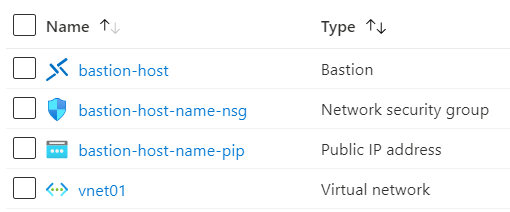

# Terraform: 101-azure-bastion-nsg
## Deploy Azure Bastion in an Azure Virtual Network
## Description

This is a conversion of ARM template *[101-azure-bastion-nsg](https://github.com/Azure/azure-quickstart-templates/tree/master/101-azure-bastion-nsg)* from the repository *[azure\azure-quickstart-templates](https://github.com/Azure/azure-quickstart-templates)* to Terraform code, and this code will deploy following the resources…



> ### Note:
> We are using data resource to fetch the details of  existing virtual network to deploy the AzureBastionSubnet to that existing virtual network.

### Syntax
```
# To initialize the configuration directory
PS C:\Terraform\101-azure-bastion-nsg> terraform init 

# To check the execution plan
PS C:\Terraform\101-azure-bastion-nsg> terraform plan

# To deploy the configuration
PS C:\Terraform\101-azure-bastion-nsg> terraform apply
```
### Example
```
PS C:\Terraform\101-azure-bastion-nsg> terraform init 

# With an existing vnet
PS C:\Terraform\101-azure-bastion-nsg> terraform plan -var="vnetname-existing=vnet01" -var="existing-rg=demo-rg" -var="vnet-new-or-existing=existing"

# With a new vnet
PS C:\Terraform\101-azure-bastion-nsg> terraform plan -var="vnet-new-or-existing=new"

<--- output truncated --->

# To deploy a new bastion host within an existing vnet
PS C:\Terraform\101-azure-bastion-nsg> terraform apply -var="vnetname-existing=vnet01" -var="existing-rg=demo-rg" -var="vnet-new-or-existing=existing" -auto-approve

# To deploy a new bastion host with a new vnet
PS C:\Terraform\101-azure-bastion-nsg> terraform apply -var="vnet-new-or-existing=new" -auto-approve
````
### Output

```
azurerm_subnet.asnet-01[0]: Creating...
azurerm_bastion_host.baiston-01-new[0]: Still creating... [10s elapsed]

<--- output truncated --->

azurerm_bastion_host.baiston-01-new[0]: Creation complete after 5m46s

Apply complete! Resources: 7 added, 0 changed, 0 destroyed

```
>Azure Cloud Shelll comes with terraform pre-installed and you deploy this configuration in Cloud Shell as well.
>
>[](https://shell.azure.com)