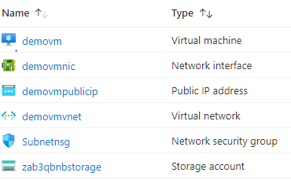

# Terraform: 101-vm-simple-rhel-unmanaged
## Deployment of Red Hat Enterprise Linux VM (RHEL 7.2 or RHEL 6.7)
## Description 
This is an Azure quickstart sample terraform configuration based on ARM template *[101-vm-simple-rhel-unmanaged](https://github.com/Azure/azure-quickstart-templates/tree/master/101-vm-simple-rhel-unmanaged)* from the repository *[azure\azure-quickstart-templates](https://github.com/Azure/azure-quickstart-templates)*.

This configuration allows deploying a Red Hat Enterprise Linux VM (RHEL 7.2 or RHEL 6.7) unmanaged disks, using the latest image for the selected RHEL version. This will deploy a Standard_DS2_v2 VM in the location of your chosen resource group with two additional 100 GiB data disks attached to the VM, and it will deploy the following resources...



> ### Note:
> If the specified resource group is already exist then the script will not continue with the deployment. If you want to deploy the resources to the existing resource group, then import the resource group to state before deployment.

### Syntax
```
# To initialize the configuration directory
PS C:\Terraform\101-vm-simple-rhel-unmanaged> terraform init 

# To check the execution plan
PS C:\Terraform\101-vm-simple-rhel-unmanaged> terraform plan

# To deploy the configuration
PS C:\Terraform\101-vm-simple-rhel-unmanaged> terraform apply
```

### Example
```
# Initialize
PS C:\Terraform\101-vm-simple-rhel-unmanaged> terraform init 

# Plan
PS C:\Terraform\101-vm-simple-rhel-unmanaged> terraform plan

var.adminUsername
User name for the Virtual Machine.
Enter a value: cloudguy

var.adminPassword
The admin password of the VM.
Enter a value: *********

var.vmName
Name for the Virtual Machine.
Enter a value: demovm

<--- output truncated --->

# Apply
PS C:\Terraform\101-vm-simple-rhel-unmanaged> terraform apply

var.adminUsername
User name for the Virtual Machine.
Enter a value: cloudguy

var.adminPassword
The admin password of the VM.
Enter a value: *********

var.vmName
Name for the Virtual Machine.
Enter a value: demovm
```
## Output
```
azurerm_virtual_network.avn-01: Creating...
azurerm_virtual_network.avn-01: Still creating... [10s elapsed]

<--- output truncated --->

azurerm_virtual_machine.avm-ssh-01: Still creating... [1m30s elapsed]
azurerm_virtual_machine.avm-ssh-01: Creation complete after 1m38s 

Apply complete! Resources: 12 added, 0 changed, 0 destroyed.
```

> Azure Cloud Shell comes with Azure PowerShell pre-installed and you can deploy the above resources using Cloud Shell as well.
>
>[](https://shell.azure.com)
