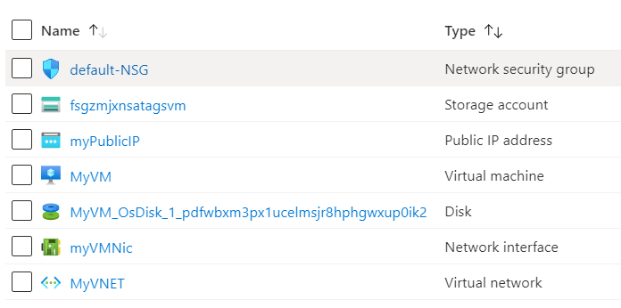

# Terraform: 101-vm-tags

## Simple deployment of a VM with Tags 

## Description

This is a conversion of ARM template *[101-vm-tags](https://github.com/Azure/azure-quickstart-templates/tree/master/101-vm-tags)* from the repository *[azure\azure-quickstart-templates](https://https://github.com/Azure/azure-quickstart-templates)* to Terraform configuration.

This configuration allows you to deploy a simple Windows VM using a few different options for the Windows version, using the latest patched version. It include tags on the Virtual Machine, Storage Account, Public IP Address, Virtual Network, and Network Interface, and it will deploy the following resources...



> ### Note:
> If there is already the specified resource group exists then the script will not continue with the deployment. If you want to deploy the resources to the existing resource group, then import the resource group to state before the deployment.

### Syntax
```
# To initialize the configuration directory
PS C:\Terraform\101-vm-tags> terraform init 

# To check the execution plan
PS C:\Terraform\101-vm-tags> terraform plan

# To deploy the configuration
PS C:\Terraform\101-vm-tags> terraform apply
```  

### Example
```
# Initialize
PS C:\Terraform\101-vm-tags> terraform init 

# Plan
PS C:\Terraform\101-vm-tags> terraform plan

var.adminUsername
Default Admin username
Enter a value: cloudguy

var.adminPassword
Password for the Virtual Machine.
Enter a value: *********

<--- output truncated --->

# Apply
PS C:\Terraform\101-vm-tags> terraform apply 

var.adminUsername
Default Admin username
Enter a value: cloudguy

var.adminPassword
Password for the Virtual Machine.
Enter a value: *********
```

### Output
```
azurerm_virtual_network.avn-01: Creating...
azurerm_public_ip.apip-01: Still creating... [20s elapsed]

<--- output truncated --->

azurerm_windows_virtual_machine.avm-01: Still creating... [2m20s elapsed]
azurerm_windows_virtual_machine.avm-01: Creation complete after 3m3s 

Apply complete! Resources: 12 added, 0 changed, 0 destroyed.
```
> Azure Cloud Shell comes with Azure PowerShell pre-installed and you can deploy the above resources using Cloud Shell as well.
>
>[](https://shell.azure.com)
